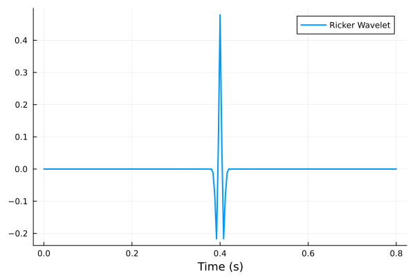
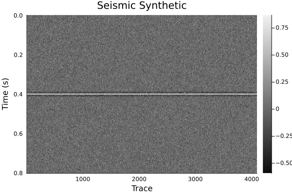

# Generating Synthetics with the LocalSignalAttributes.jl Package

The `LocalSignalAttributes.jl` package provides tools to generate synthetic seismic signals. This guide demonstrates how to generate a Ricker wavelet using the `ricker` function and visualize it.

---

## Function: `ricker`

```julia
ricker(input::Array; dt=1.0, f=0.2)

The ricker function generates a Ricker wavelet (commonly used in seismic studies) from an input array.
Parameters:
input::Array: Input array (e.g., spike signal).
dt=1.0: Time sampling interval in seconds (default = 1.0).
f=0.2: Dominant frequency of the Ricker wavelet in Hz (default = 0.2).
```

Below is an example of how to use the ricker function to generate a Ricker wavelet from a spike signal and plot it using the Plots.jl library.

```julia-repl
using LocalSignalAttributes
using Plots

# Define parameters
nt = 201               # Number of time samples
dt = 0.004             # Time sampling interval (seconds)

# Create a spike signal (impulse in the middle)
spike = zeros(Float32, nt)
spike[1 + (nt - 1) ÷ 2] = one(Float32)

# Generate time axis
t = range(start=0, step=dt, length=nt)

# Generate the Ricker wavelet
ricker1 = ricker(spike; dt=dt, f=25.0)

# Plot the Ricker wavelet
plot(t, ricker1, xlabel="Time (s)", ylabel="Amplitude", lw=2, legend="Ricker Wavelet")

```
### Output:

The plot will display the Ricker wavelet with its amplitude versus time, providing an intuitive visualization of this synthetic signal.



### Generating Toy Seismic Synthetic (A Flat Event)

### Code:

```julia-repl
using LocalSignalAttributes
using Plots

# Generate a Ricker wavelet
nt = 201               # Number of time samples
dt = 0.004             # Time sampling interval (seconds)
spike = zeros(Float32, nt)
spike[1 + (nt - 1) ÷ 2] = one(Float32)
t = range(start=0, step=dt, length=nt)
ricker1 = ricker(spike; dt=dt, f=25.0)

# Create a flat event (multiple identical traces)
ntraces = 4096
traces = repeat(ricker1, 1, ntraces)

# Add noise to the flat event
noisy_traces = traces .+ randn(size(traces)) * 0.1
# noisy_traces = traces  # Uncomment to visualize without noise

# Plot the noisy flat event as a heatmap
heatmap(1:ntraces, t, noisy_traces, 
        yflip=true, cmap=:grays, 
        title="Input", ylabel="Time (s)", xlabel="Trace")
```


